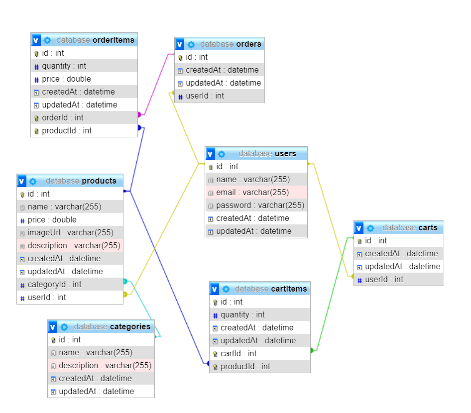

## ecommerce sequelize api

- 20%

## :rocket: Tech Stack

- NodeJs
- Express
- Sequelize
- Mysql

## :cd: How to run local

At the root of your project create an .env file with the following contents:

```javascript
JWT_SECRET=<YOUR_SECRET>
```

src/config/database.js mysql config

```javascript
const sequelize = new Sequelize('database', 'root', '<YOUR_SECRET>', {
  host: 'localhost',
  port: 3306,
  dialect: 'mysql',
})
```

```
- npm install
- npm run start:dev
```

### database relationships


